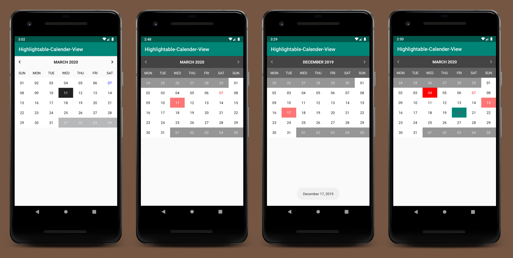
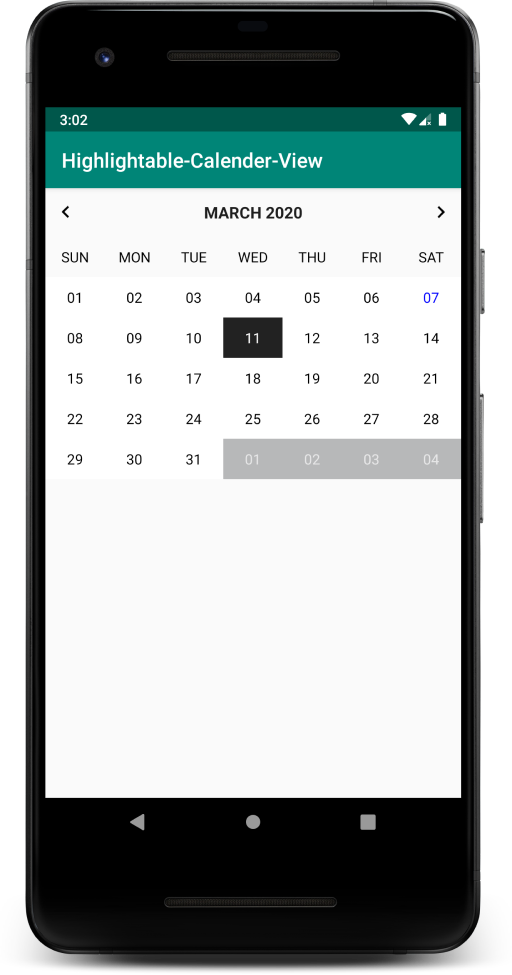
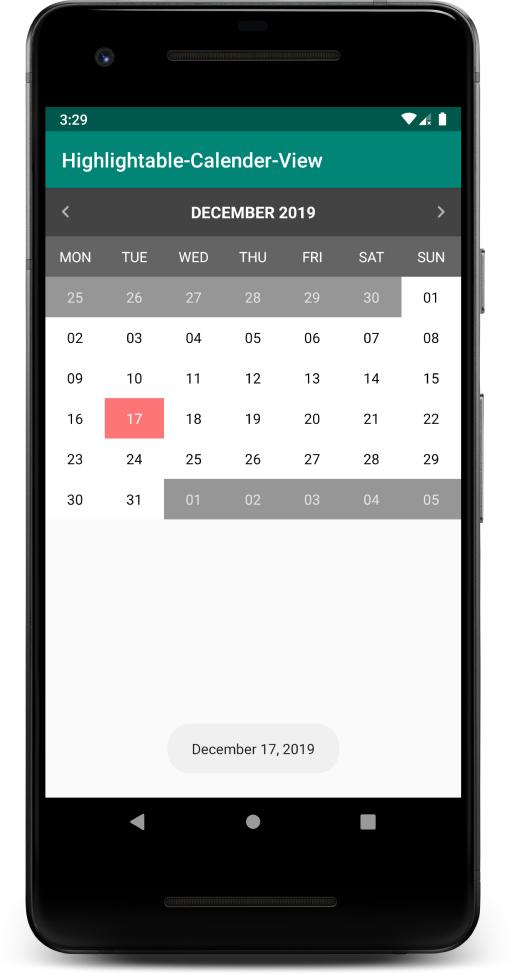
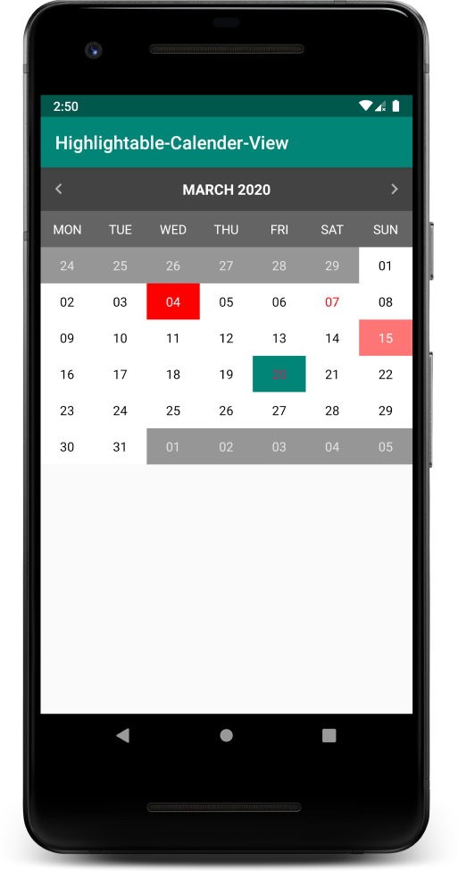

# Highlightable Calendar View

[](https://jitpack.io/#com.varunbarad/highlightable-calendar-view)

This is a calendar-view which lets you highlight individual days in specific colors. You can also customize almost every aspect of it. You can use this library in your application by adding it to your dependencies in your gradle build script.

If you enjoy this library, send me a tweet [@varun_barad](https://twitter.com/varun_barad) or visit my [blog](https://varunbarad.com/blog).

## Features

Currently it supports following features:

- Next and previous month navigation.
- Allow various customisations including background and text color for day, week, month.
- Set custom start-of-week day. It defaults to Sunday.
- Event callbacks for month-change and date-select.
- Highlighting individual days' text and background colors with decorators.



## Adding in your project

__Step 1:__ Add the JitPack repository to your root-level `build.gradle` file.

```groovy
repositories {
    maven { url "https://jitpack.io" }
    ...
}
```

__Step 2:__ Add the dependency in your module-level `build.gradle`

```groovy
dependencies {
    implementation "com.varunbarad:highlightable-calendar-view:1.0.0"
    ...
}
```

## Usage

### Basic use

The GitHub project source includes a sample application, that is used for demonstrating the various features currently supported by this library. Once the library is added to your project, you can include the `HighlightableCalendarView` into your layout using the following code snippets.

```xml
<com.varunbarad.highlightable_calendar_view.HighlightableCalendarView
    android:id="@+id/calendarView"
    android:layout_width="match_parent"
    android:layout_height="wrap_content" />
```

The above code-snippet will show a simple calendar with its default styles. Look into next section for how to customise its appearance.



### Customising the calendar

Once you have included the calendar-view in your layout, you can customise its appearance with following attributes:

```xml
<com.varunbarad.highlightable_calendar_view.HighlightableCalendarView
    android:id="@+id/calendar"
    android:layout_width="mat"
    android:layout_height="wrap_content"
    app:dayBackgroundColorDisabled="#66000000"
    app:dayBackgroundColorEnabled="#ffffff"
    app:dayTextColorCurrentDay="#ff0000"
    app:dayTextColorDisabled="#bbffffff"
    app:dayTextColorEnabled="#000000"
    app:firstDayOfWeek="monday"
    app:selectedDay_backgroundColor="#88ff0000"
    app:selectedDay_textColor="#ffffff"
    app:titleBackgroundColor="#bb000000"
    app:titleMonthChangeButtonTint="#99ffffff"
    app:titleTextColor="#ffffff"
    app:weekDay_backgroundColor="#99000000"
    app:weekDay_textColor="#ffffff" />
```


### Handling calendar events

The calendar emits 2 types of events. You can subscribe to each using below mentioned listeners.

__1. Month Change event__

The calendar fires an event whenever the month is changed, you can subscribe to it by providing a `OnMonthChangeListener`

```kotlin
calendarView.onMonthChangeListener = OnMonthChangeListener { oldMonth, newMonth ->
    val oldMonthDisplay = oldMonth.getDisplayName(
        Calendar.MONTH,
        Calendar.LONG,
        Locale.getDefault()
    )
    val newMonthDisplay = newMonth.getDisplayName(
        Calendar.MONTH,
        Calendar.LONG,
        Locale.getDefault()
    )

    Toast.makeText(
        this,
        "$oldMonthDisplay -> $newMonthDisplay",
        Toast.LENGTH_SHORT
    ).show()
}
```

__2. Date Select event__

The calendar also fires an event when user taps on any date, you can subscribe to it by providing a `OnDateSelectListener`

```kotlin
calendarView.onDateSelectListener = OnDateSelectListener { selectedDate ->
    val date = String.format("%02d", selectedDate.get(Calendar.DAY_OF_MONTH))
    val month = selectedDate.getDisplayName(
        Calendar.MONTH,
        Calendar.LONG,
        Locale.getDefault()
    )
    val year = selectedDate.get(Calendar.YEAR).toString()

    Toast.makeText(this, "$month $date, $year", Toast.LENGTH_SHORT).show()
}
```



### Customising individual days using Decorators

You can provide a list of decorators which help you to customise the text and background colors for any number of days individually.

```kotlin
calendarView.dayDecorators = listOf(
    DayDecorator(
        Calendar.getInstance().apply { set(Calendar.DAY_OF_MONTH, 4) },
        Color.parseColor("#ffffff"),
        Color.parseColor("#ff0000")
    ),
    DayDecorator(
        Calendar.getInstance().apply { set(Calendar.DAY_OF_MONTH, 20) },
        ContextCompat.getColor(this, R.color.colorAccent),
        ContextCompat.getColor(this, R.color.colorPrimary)
    )
)
```


